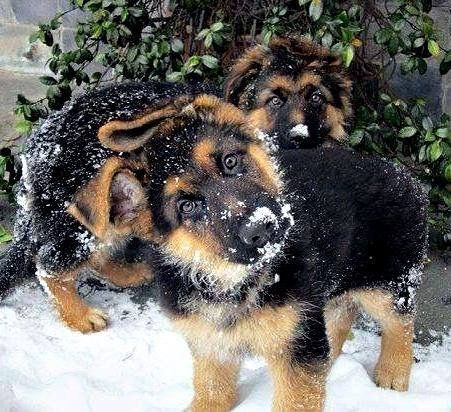

```{r setup, include=FALSE}
knitr::opts_chunk$set(echo = TRUE)
```

### Load packages

```{r load_data, message=FALSE, warning=FALSE, paged.print=FALSE}
library(tidyverse)
library(here)
library(skimr)
library(janitor)
```

### Read data 

In this report, I explore Petfinder data. Petfinder is an online database of animals who need homes. Using the [PetFinder API](https://www.petfinder.com/developers/v2/docs/#introduction) and R, I downloaded data available for the city of Los Angeles, CA by April 2023. A glimpse of the dataset is shown below: 

```{r read_data, message=FALSE, warning=FALSE, paged.print=FALSE}
dogs <- read_csv(here("data","dogs_LA_data.csv.csv")) # dogs looking for forever homes in LA (via Petfinder.com)

head(dogs)
```

### Tidy columns in the data

Before conducting any analysis, data processing was performed. In this stage, the dataset was cleaned and prepared for easy manipulation.

```{r tidy_columns, message=FALSE, warning=TRUE, paged.print=TRUE}
tidydogs <- dogs %>% 
  filter(type == "Dog") %>% 
  clean_names() %>% # Careful with the autopredict in the next lines, because column names might change
  rename(house_trained = attributes_house_trained,
         spayed_neutered = attributes_spayed_neutered,
         declawed = attributes_declawed,
         spatial_needs = attributes_special_needs) %>% 
  select(id, age, gender, type, species, name, breeds_primary, breeds_secondary, breeds_mixed, breeds_unknown, status, description, contact_address_address1, contact_address_city)

names(tidydogs) # list the new column names

```
Since the column names were already in good shape, it just changed a few (.) to (_). The original dataset has 49 columns with information about the dogs, and only 14 columns were selected for this study.

### Plot total number of dogs looking for home by breed

As part of the data exploration, I plotted the total number of dogs looking for forever home by age and gender, but only including my favorite breeds. I started by creating that list.

```{r create_list, warning=FALSE}

#Create a list of favorite/known breeds
fav_breeds <- c("Labrador Retriever", "Husky", "Shih Tzu", "Belgian Shepherd / Malinois", "Siberian Husky", "Dutch Shepherd", "Golden Retriever", "Belgian Shepherd / Laekenois", "German Shepherd Dog", "Shepherd", "Dachshund", "Mixed Breed", "Australian Shepherd", "Akita")
```

For plotting, I use the `ggplot package` contained in `tidyverse` and the `geom_count` function that is used for discrete variables, and it creates a bubbleplot. [See more info here.](https://stulp.gmw.rug.nl/ggplotworkshop/twodiscretevariables.html#bubbleplot) `geom_count` creates a new dataframe on the basis of the dataframe 'tidydogs.' As stated in the manual: "A way of using the variables that geom_count has created, is by referring to them with the “`..`” before, and after. By default, the counts will be used (`..count..`), but we can also refer to the proportions in the created dataframe by using: `size=..prop...` (we specify `group=class` to signal to `geom_count` that we want the proportions within class) Below you can see the dataframe that was created through `geom_count`"

```{r plot_total_prop_by_breed, warning=FALSE}
#create plot using proportions by breed
tidydogs %>% 
  filter(breeds_primary %in% fav_breeds) %>% # using only the breeds_primary attribute for this selection
  ggplot(aes(x = age,  y = breeds_primary, color = gender)) +
  geom_count(aes(size=..prop.., group = breeds_primary)) + 
  scale_size_area() + # ensures that counts of zero would be given size 0--learned this reading the documentation for geom_count :)
  facet_wrap(~ gender)
```

I compared these results with the ones obtained while using the default `counts` instead of `prop` (proportions)

```{r plot_total_counts_by_breed, warning=FALSE}
#create plot using total counts
tidydogs %>% 
  filter(breeds_primary %in% fav_breeds) %>% 
  ggplot(aes(x = age,  y = breeds_primary, color = gender)) +
  geom_count(aes(group = breeds_primary)) + 
  scale_size_area() + # ensures that counts of zero would be given size 0--learned this reading the documentation for geom_count :)
  facet_wrap(~ gender)
```

Then, I compared the results with the actual data, by doing some data wrangling as used in lesson 2.

```{r check_plot_results, warning=FALSE}
tidydogs %>% 
  filter(breeds_primary %in% fav_breeds) %>% 
  group_by(breeds_primary, age, gender) %>% 
  count() %>% 
  rename(count = n) %>% 
  arrange(-count)
```
Based on these results, both plots are helpful for decision-making. The second plot that uses count and not proportions is helpful to select across breeds, and the first plot would be useful for making the decision while comparing results just within a specific breed but still having a whole picture of the options.

**That's all for this week!**



